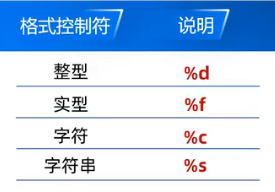

# 输出常量

`printf(参数1，参数2)`

***参数1： 输出内容的最终样式，以字符串的形式体现***

***参数2：选填填补的内容***

格式控制符也叫占位符



```c
/*
输出案例-输出整数
*/

#include <stdio.h>

int main()
{
    printf("年龄: %d", 18);
    return 0;
}
```

## 输出多个常量

```c
#include <stdio.h>

int main()
{
    printf("My name is %s; My school is %s; My age is $d" , "LingXiao", "QuXian High School", 18);
    return 0;
}
```

## 换行符

| 操作系统 | 换行符 |
| -------- | ------ |
| windows  | \r\n   |
| mac      | \r     |
| Linux    | \n     |

```c
#include <stdio.h>

int main()
{
    printf("My name is %s\r\n My school is %s\r\n My age is %d\r\n" , "LingXiao", "QuXian High School", 18);
    return 0;
}
```

***C语言对换行符进行了优化，只需使用 `\n` C会根据操作系统自动匹配***
