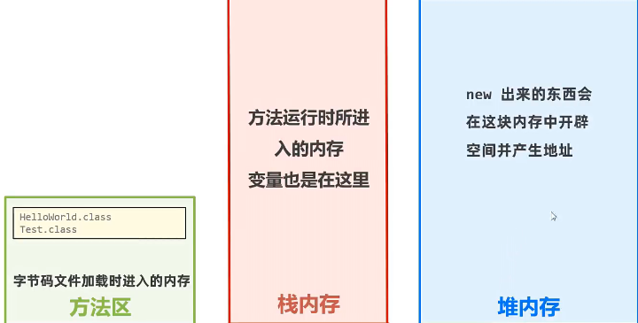
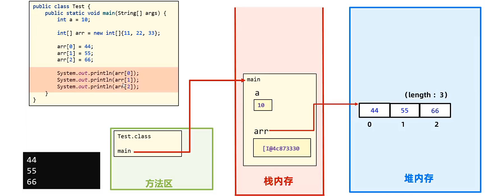
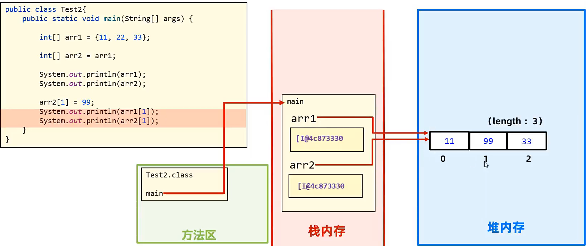

# JAVA 数组笔记
## 一.概念
数组是用来存储一批相同类型数据的内存区域（可以理解为容器）  
### 例子
```java
int[] arr = {20,10,80,60,90};
String[] arr = {"a","b","c","d","e"};
```
## 二.定义数组
### (一)静态初始化数组
[示例代码](lib/46-51.array/src/class1/summer_camping/arrayDemo1.java)
#### 1.概念
定义数组时直接给数组赋值
#### 2.语法
```java
//完整语法
数据类型[] 数组名 = new 数据类型[]{元素1,元素2,元素3...};
int[] arr = new int[]{20,10,80,60,90};
double[] arr = new double[]{20.0,10.0,80.0,60.0,90.0};
//简略语法
数据类型[] 数组名 = {元素1,元素2,元素3...};
int[] arr = {20,10,80,60,90};
```
#### 3.基本原理
   
***注意：数组变量中储存的是数组地址，是引用类型***
 
### (二)动态初始化数组
[代码示例](lib/46-51.array/src/class1/summer_camping/arrayDemo3.java)
#### 1.概念
定义数组的时候只确定元素的类型和数组的长度，之后再存入具体数据
#### 2.语法
```java
//数据类型[] 数组名 = new 数据类型[数组长度];
int[] arr = new int[5];

//后续赋值
arr[0] = 20;
System.out.println(arr[0]);
```
  
***注意：数组变量中储存的是数组地址，是引用类型***

#### 3.动态初始化数组的元素默认值
[示例代码](lib/46-51.array/src/class1/summer_camping/arrayDemo4.java)
##### 元素默认值规则
  

## 三.数组的访问
[代码示例](lib/46-51.array/src/class1/summer_camping/arrayDemo2.java)
  
```java
//格式：数组名称[索引]

//TODO:取值
System.out.println(arr[0]);

//TODO:赋值
arr[2] = 100;
System.out.println(arr[2]);

//数组的长度属性：length
System.out.println(arr.length);
```
## 三.场景总结
·动态初始化数组：***只指定数组长度***，***后续赋值***，适合开始知道数据数量，但不确定具体数据的场景  
·静态初始化数组：***同时指定数组长度和具体数据***，适合开始知道数据数量，并且确定具体数据的场景  
·两种格式的写法是独立的，不可以独立使用  

```java
int[] arr = new int[5]{30,40,50};
//错误写法
```

## 四.数组的注意事项
1.`数据类型[] 数组名` 也可以写成 `数据类型 数组名[]`  
2.`数组类型`和`存放的数据类型` **必须一致**  
3.数组一旦定义，**在程序执行过程中，长度、类型就固定了**

## 五.数组的遍历
[代码示例](lib/46-51.array/src/class2/summer_camping_plan/arrayDemo1.java)
### （一）概念
遍历数组，就是依次取出数组中的每一个元素

### （二）语法
```java
int[] arr = {20,10,80,60,90};
for(int i = 0; i < arr.length; i++){
    System.out.println(arr[i]);
}
```
### （三）遍历数组案例
#### 1.求和
[代码示例](lib/46-51.array/src/class2/summer_camping_plan/arrayDemo2.java)
#### 2.求最大值
[代码示例](lib/46-51.array/src/class2/summer_camping_plan/arrayDemo3.java)
#### 3.猜数字游戏
[代码示例](lib/46-51.array/src/class2/summer_camping_plan/arrayDemo4.java)
#### 4.随机排名
[代码示例](lib/46-51.array/src/class2/summer_camping_plan/arrayDemo5.java)
#### 5.冒泡排序
[代码示例](lib/46-51.array/src/class2/summer_camping_plan/arrayDemo6.java)
## 数组的内存图
### JAVA内存分配介绍
***·栈***  
***·堆***  
***·方法区***  
·本地方法栈  
·寄存器  


### 两个变量指向同一数组


## 数组使用的常见问题
1.如果数组访问的元素索引值过大，会抛出`ArrayIndexOutOfBoundsException(数组索引越界)`异常
2.如果数组中没有储存地址（null），会抛出`NullPointerException(空指针异常)`异常

