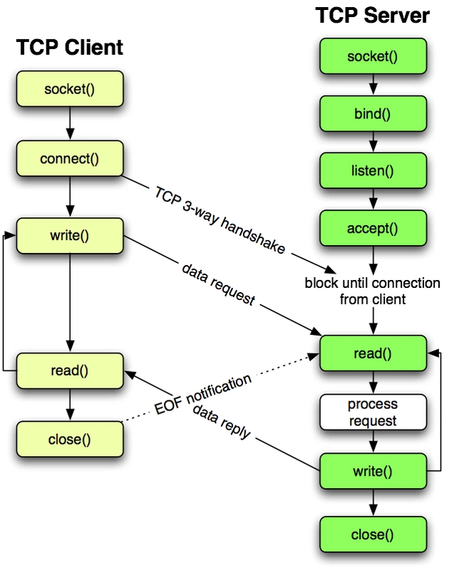

# Socket 是什么

中文含义：套接字

英文含义：插座

端口 -> 插座上的孔（不能同时被其他进程占用）

建立连接 -> 将插头插入插孔

当创建一个 Socket 实例后，就开始监听着消息的传入，谁拨通“IP 地址或端口”，就接通

Socket 是应用层和传输层之间的一个抽象层：用于将 TCP/IP 层复杂的操作抽象成简单的接口


# Socket 有哪些类型

socket 有很多种：DARPA Internet 地址（Internet 套接字）······

根据数据的传输方式，可以将 Internet 套接字分为两种类型

## 流格式套接字 （SOCK_STREAM）

流格式套接字（Stream Sockets）也叫“面向连接的套接字”，是一种可靠的、双向的通信数据流，数据可以准确无误地到达另一台计算机，如果损坏或丢失，可以重新发送。

特点：

· 数据在传输过程中不会消失

· 数据按顺序发送

· 数据的发送和接收不同步

流格式套接字在传输过程中使用 TCP 协议（The Transmission Control Protocol 传输控制协议），其会控制数据按顺序到达且无错误

​	IP（Internet Protocol 网络协议）是用来控制数据如何从源头到达目的地的，也就是“路由”

数据的发送和接收不同步？

​	流式套接字的内部有一个缓冲区（字符数组），通过 Socket 传输过来的数据将保存到缓冲区，接收端可以在接收到数据后不立即读取，只要缓冲区未被填满，接收端完全可以按自己来读取（可能是一次性读取完毕，也可能是分批次读取），也就是当数据到达后，并未要求强制立马读取，而是由接收端决定。

浏览器就是使用的面向连接的套接字，否则，浏览器可能无法正确显示 HTML

## 数据报格式套接字（SOCK_DGRAM）

数据报格式套接字（Datagram Sockets）也叫“无连接的套接字”。计算机只管传输数据，不作数据校验，如果数据在传输中损坏，或者没有到达另一台计算机，是没有办法补救的。数据错了就错误，不给你重传。

因为数据报格式套接字未对数据进行更多校验，所有传输效率比流格式套接字高

特点：

· 强调速度而不是顺序

· 传输的数据可能不准确

· 每次传输的数据大小限制

· 数据的发送和接收同步

就像物流公司一样，将大批货物分批发给卡车司机，司机可能走不同路线，遇到不同情况，所以到达顺序可能不同。而且可能“丢件”。

当货物到达后，需要你当面签收，来多少个司机，你就得收多少次，即数据的发送和接收同步

数据报套接字使用 IP 协议作路由，但与流格式套接字不一样的是它使用了 UDP 协议（User Datagram Protocol  用户数据报协议）

视频和语音聊天就使用 SOCK_DGRAM 来传输数据，首先要保证通信尽量减小延迟，而数据的正确性是次要的，即使丢失很小的一部分数据，视频和音频也可以正常解析，最多出现噪点或杂音，不会对通信质量有实质的影响。

注意：SOCK_DGRAM 不会频繁的丢失数据，

# Socket 通信过程

通信模型是服务器和客户端之间的通信。两端都建立 Socket 对象，通过 Socket 对象对数据传输。通常服务端处于无限循环监听客户端的连接

面向连接的 TCP 时序图：



## 客户端连接过程

1.创建Socket

2.连接服务器

3.将Socket与远程主机连接（注意：只有TCP才有“连接”的概念，一些 Socket 比如 UDP、ICMP 和 ARP 没有“连接”的概念）

4.发送数据

5.读取响应数据

6.数据交换完成，关闭连接，结束TCP对话

```python
import sys
import socket

sock = socket.socket(socket.AF_INET, socket.SOCK_STREAM)  # 创建 Socket 连接（socket.AF_INET -> IPV4传输协议 TCP/IP 连接）
    sock.connect(('127.0.0.1', 8001))  # 连接服务器
    while True:
        data = input('data:')
        if not data:
            break
        try:
            sock.sendall(data)# 这里也可用 send() 方法：不同在于 sendall() 在返回前会尝试发送所有							      数据，并且成功时返回 None，而 send() 则返回发送的字节数量，失败时								 都抛出异常。
        except socket.error as e:
            print('Send Failed...', e)
            sys.exit(0)
        print('Send Successfully')

        res = sock.recv(4096)  # 获取服务器返回的数据，还可以用 recvfrom()、recv_into() 等
        print(res)
    sock.close()
```

## 服务端过程

1.初始化 Socket，建立流式套接字，与本机地址及端口进行绑定

2.通知 TCP，准备好接收连接，调用 `accept()` 阻塞，等待来自客户端的连接。

3.如果这时客户端与服务器建立了连接，客户端发送数据请求

4.服务器接收请求并处理请求，然后把响应数据发送给客户端，客户端读取数据，直到数据交换完毕。

5.关闭连接，交互结束

```python
import socket
import sys

if __name__ == '__main__':
    sock = socket.socket(socket.AF_INET, socket.SOCK_STREAM)  # 创建 Socket 连接（TCP）
    try:
        sock.bind(('127.0.0.1', 8001))  # 配置 Socket，绑定 IP 地址和端口号
    except socket.error as e:
        print('Bind Failed...', e)
        sys.exit(0)

    sock.listen(5)  # 设置最大允许连接数，各连接和 Server 的通信遵循 FIFO 原则

    while True:  # 循环轮询 Socket 状态，等待访问
        conn, addr = sock.accept()
        try:
            conn.settimeout(10)  # 如果请求超过 10 秒没有完成，就终止操作

            # 如果要同时处理多个连接，则下面的语句块应该用多线程来处理
            while True:  # 获得一个连接，然后开始循环处理这个连接发送的信息
                data = conn.recv(1024)
                print('Get value ' + data, end='\n\n')
                if not data:
                    print('Exit Server', end='\n\n')
                    break
                conn.sendall('OK')  # 返回数据
        except socket.timeout:  # 建立连接后，该连接在设定的时间内没有数据发来，就会引发超时
            print('Time out')

        conn.close()  # 当一个连接监听循环退出后，连接可以关掉
    sock.close()
```

***`FIFO`*** :即先进先出（First in ,First out）,如果服务器同时收到多个连接请求，它会按照这些请求到达的顺序来接受和处理它们。

***`accept()`*** :当调用次函数时，Socket 进人waiting状态，当客户端请求连接时，建立连接。

​		     conn -> 新的 Socket 对象，服务器通过其处理通信

​		     addr -> 客户端IP,端口

***`send()` , `recv()`*** :服务器调用 `send()`，并采用字符串形式向客户端发送信息，`send()` 返回已发送的字符个				  数。

​				  服务器调用 `recv()` 从客户端接收信息。调用 `recv()` 时，服务器必须指定一个整数，它对				  应于可通过本次方法调用来接收的最大数据量。`recv()` 在接收数据时会进入blocked状态，				  最后返回一个字符串，用它表示收到的数据。如果发送的数据量超过了 `recv()` 所允许的，数				  据会被截短。多余的数据将缓冲于接收端，以后调用 `recv()` 时，会继续读剩余的字节，如果				  有多余的数据会从缓冲区删除（以及自上次调用 `recv()` 以来，客户端可能发送的其它任何数				  据）。传输结束，服务器调用 Socket 的 `close()` 关闭连接。

[Socket（套接字）通信原理 - co](https://www.cnblogs.com/myitnews/p/13790067.html)
